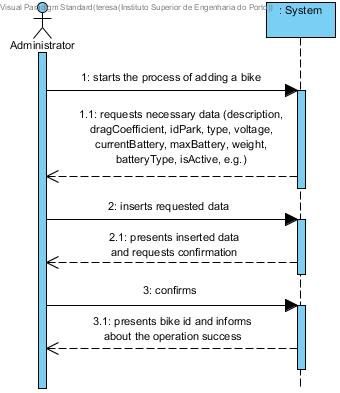
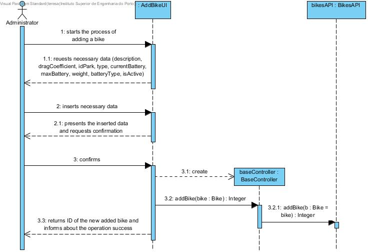
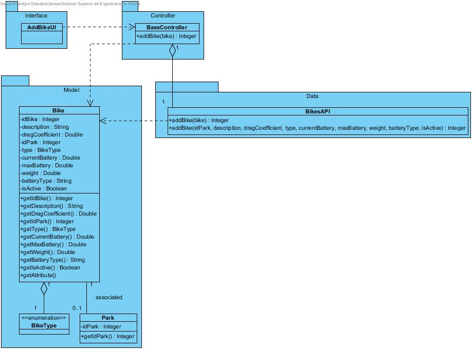

# **UC01 Add Bicycle**

JIRA Issue: [LAPR3G045-1](https://jira.dei.isep.ipp.pt:8443/browse/LAPR3G045-1)

## **1. Analysis**

### Brief Description

An administrator should manage Bicycle. This use case translates the adding action on system. It starts as administrator starting the use case by invoking addBicycle method. System will ask for input data (description, dragCoefficient, idPark, type, currentBattery, maxBattery, weight, batteryType, isActive). After adding such data, administrator will be asked for confirmation. After confirmation the system will respond with success with bicycle ID.

### Main Actor

Administrator

### System Sequence Diagram (SSD)

## **2. Design**

### Sequence Diagram

### Class Diagram

