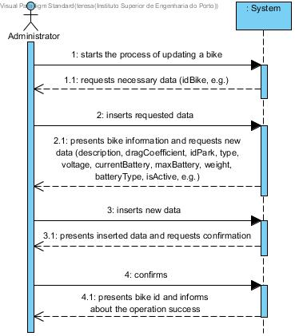
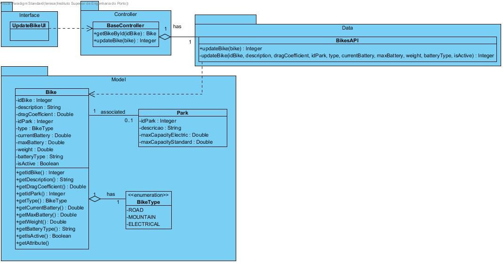

# **UC02 Update Bicycle**

JIRA Issue: [LAPR3G045-2](https://jira.dei.isep.ipp.pt:8443/browse/LAPR3G045-2)

## **1. Analysis**

### Brief Description

Application's admin starts the process of updating bicycle's information. The System requests bicycle id. System validates bicycle id and presents bicycle information and requests all necessary information (idBike, description, dragCoefficient, idPark, type, currentBattery, maxBattery, weight, batteryType, isActive). The System presents all the information inserted by the admin and request confirmation. The admin confirms. The System register the operation and informs about the operation sucess.

### Main Actor

Admin

### System Sequence Diagram (SSD)

## **2. Design**

### Sequence Diagram

### Class Diagram

