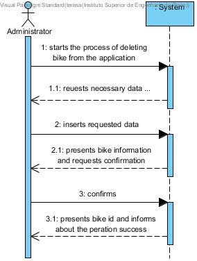
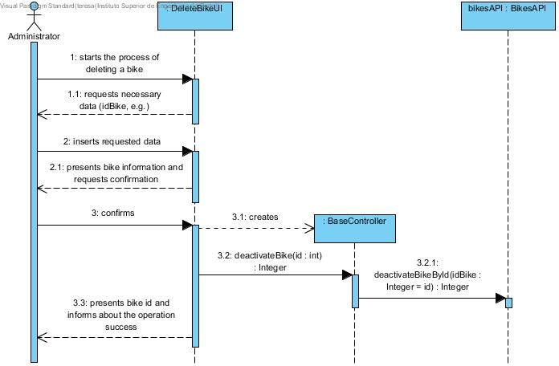
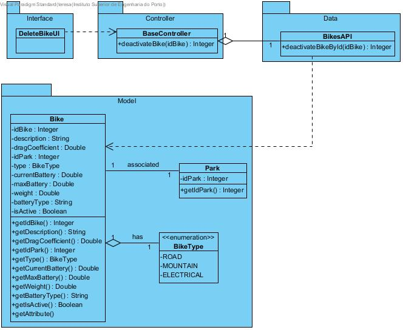

# **UC03 Delete Bicycle**

JIRA Issue: [LAPR3G045-3](https://jira.dei.isep.ipp.pt:8443/browse/LAPR3G045-3)

## **1. Analysis**

### Brief Description

Admin starts the process of deleting a bike from the application. The system will request necessary data (idBike, e.g.). The admin inserts requested data. System requests confirmation. After confirmation, system will deactivate bike and retuen bike id informing about the operation success. 

### Main Actor

Admin

### System Sequence Diagram (SSD)

## **2. Design**

### Sequence Diagram

### Class Diagram

