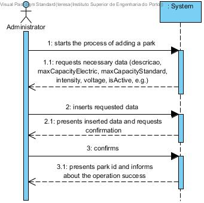
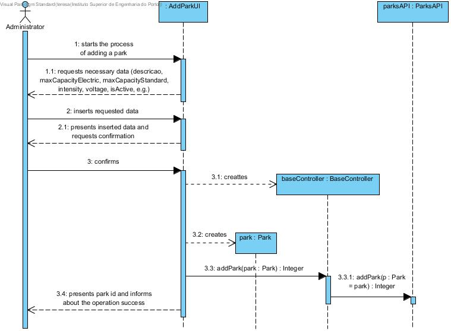
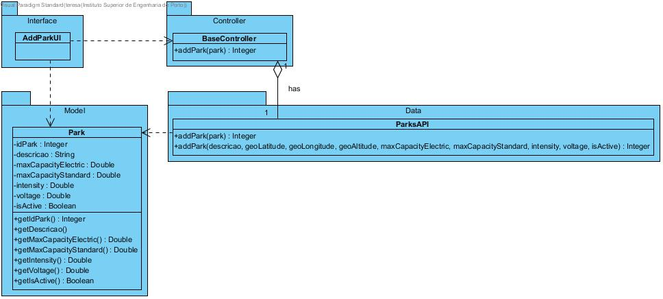

# **UC04 Add Park**

JIRA Issue: [LAPR3G045-4](https://jira.dei.isep.ipp.pt:8443/browse/LAPR3G045-4)

## **1. Analysis**

### Brief Description

Admin starts the process of adding a park to the application. The system requests necessary data (descricao, maxCapacityElectric, maxCapacityStandard, intensity, voltage, isActive, e.g.). Admin inserts requested data. System presents inserted data and requests confirmation. After confirmation the system will return park id and informs about the operation success.

### Main Actor

User

### System Sequence Diagram (SSD)

## **2. Design**

### Sequence Diagram

### Class Diagram

