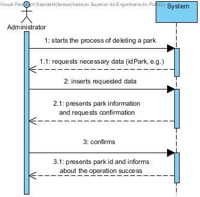
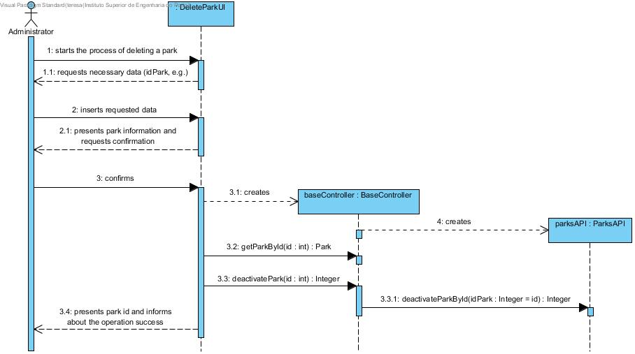
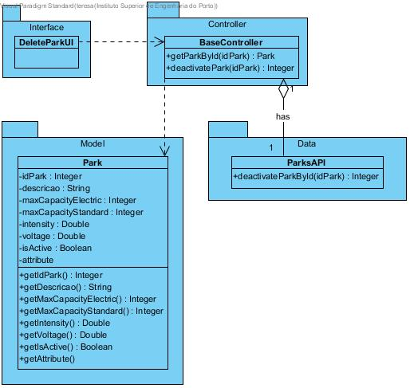

# **UC05 Delete Park**

JIRA Issue: [LAPR3G045-5](https://jira.dei.isep.ipp.pt:8443/browse/LAPR3G045-5)

## **1. Analysis**

### Brief Description

Admin starts the process of deleting a park from application. The system requests necessary data (idPark, e.g.). After inserting requested data the system will present park information and confirmation. After confirming the system will deactivate the specified park and returns park id informing about the operation success.

### Main Actor

Administrator

### System Sequence Diagram (SSD)

## **2. Design**

### Sequence Diagram

### Class Diagram

