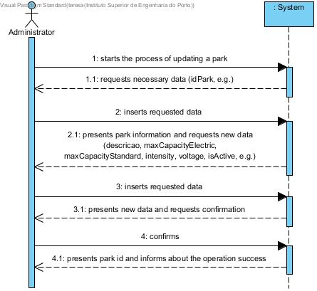
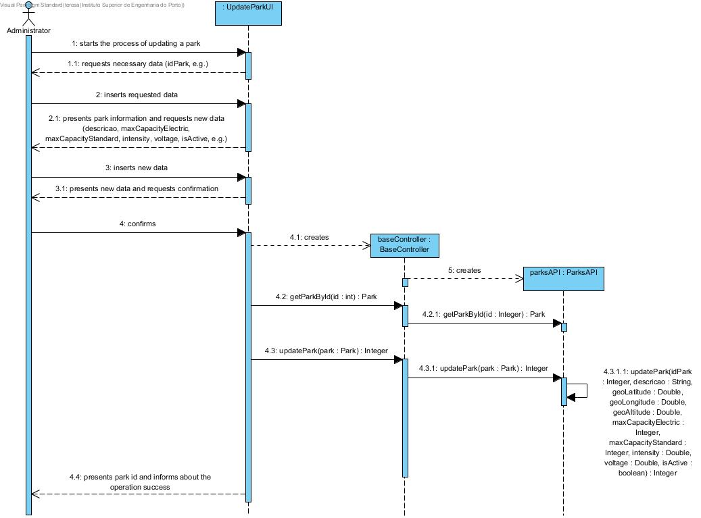
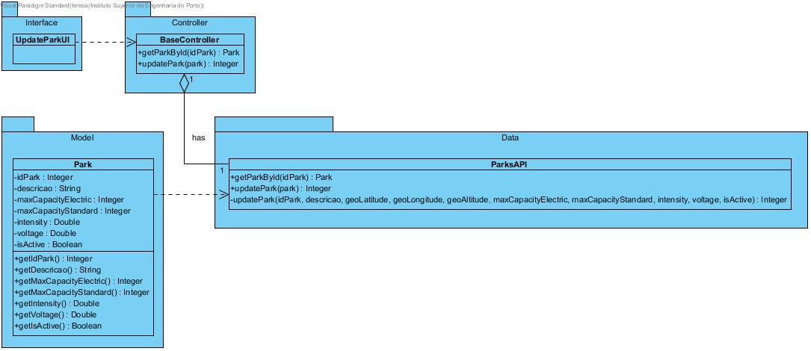

# **UC07 Update Park**

JIRA Issue: [LAPR3G045-7](https://jira.dei.isep.ipp.pt:8443/browse/LAPR3G045-7)

## **1. Analysis**

### Brief Description

An administrator starts the process of updating a park information. The system requests necessary data (idPark). The system presents park information and requests new necessary data (descricao, maxCapacityElectric, maxCapacityStandard, intensity, voltage, isActive, e.g.). After insertion of requested data the system will present this data and requests confirmation. Admin confirms and the system presents park id and informs about the operation success. 

### Main Actor

Admin

### System Sequence Diagram (SSD)

## **2. Design**

### Sequence Diagram

### Class Diagram

