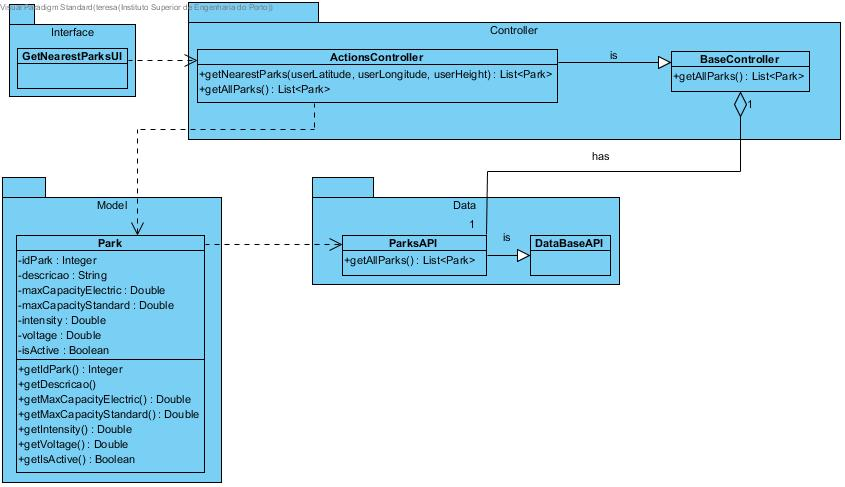

# **UC08 List Nearest Parks**

JIRA Issue: [LAPR3G045-8](https://jira.dei.isep.ipp.pt:8443/browse/LAPR3G045-8)

## **1. Analysis**

### Brief Description

A user requests for a list of the nearests parks from his/her location. The system requests necessary data (userLatitude, userLongitude, userAltitude). User inserts requested data. System presents inserted data and requests confirmation. After confirmation the system presents a list of the five nearest parks and informs about the operation success.

### Main Actor

User

### System Sequence Diagram (SSD)

## **2. Design**

### Sequence Diagram

### Class Diagram

