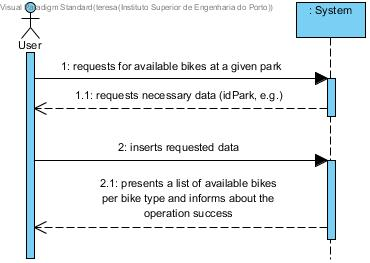
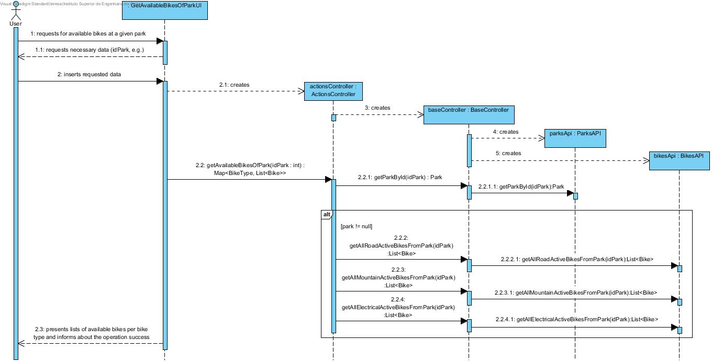
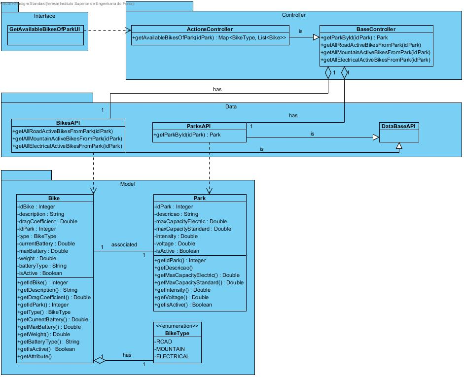

# **UC09 Get Available Bicycles of Park**

JIRA Issue: [LAPR3G045-9](https://jira.dei.isep.ipp.pt:8443/browse/LAPR3G045-9)

## **1. Analysis**

### Brief Description

User requests for available bikes from a given park. System requests necessary data (idPark, e.g.). User inserts requested data. System presents a list of available bikes per bike type and informs about the operation success.

### Main Actor

User

### System Sequence Diagram (SSD)

## **2. Design**

### Sequence Diagram

### Class Diagram

