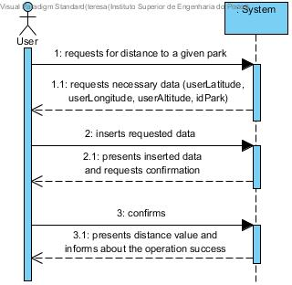

# **UC10 Check Distance from User to Park**

JIRA Issue: [LAPR3G045-10](https://jira.dei.isep.ipp.pt:8443/browse/LAPR3G045-10)

## **1. Analysis**

### Brief Description

User requests for the distance to another park. System requests necessary data (userLatitude, userLongitude, userAltitude, idPark). User inserts requested data. System presents inserted data and requests confirmation. After confirmation system presents distance value and informs about the operation success.

### Main Actor

User

### System Sequence Diagram (SSD)

## **2. Design**

### Sequence Diagram

### Class Diagram

