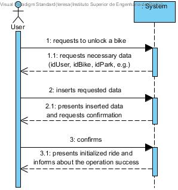
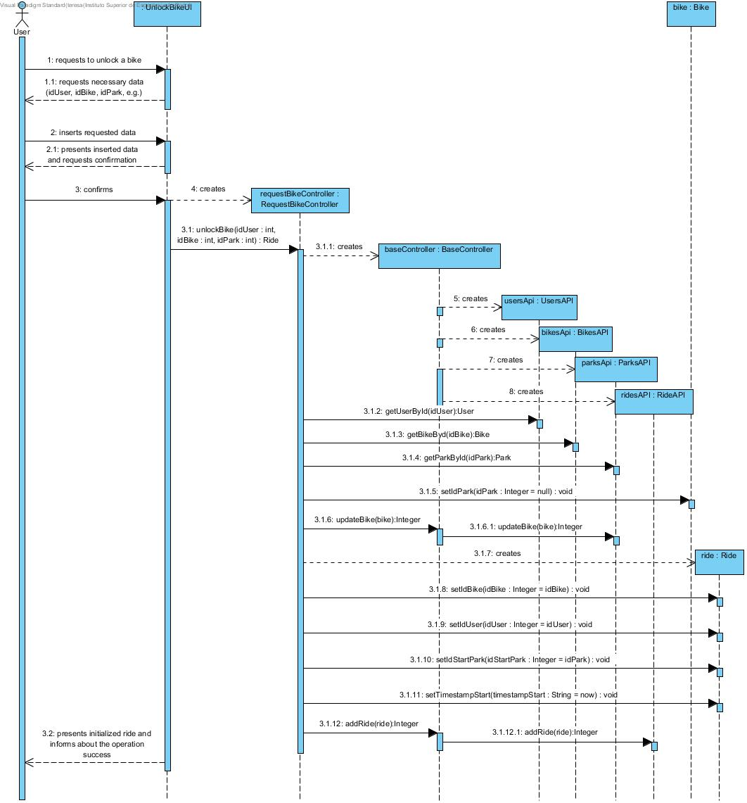
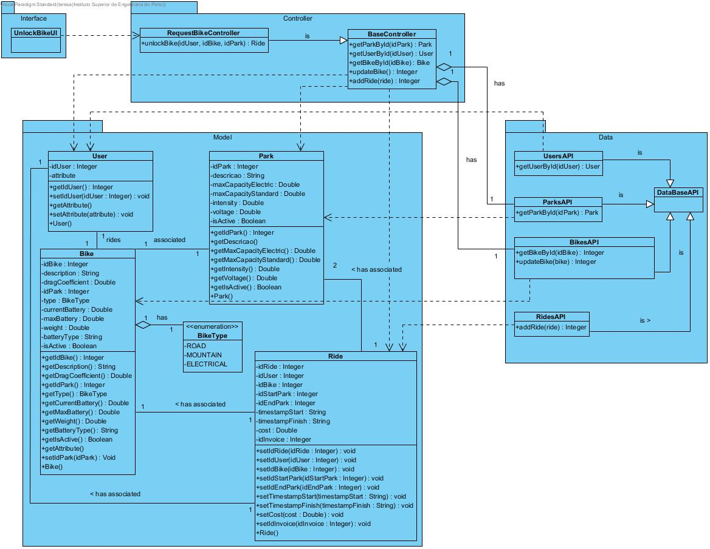

# **UC11 Unlock Bicycle (Get Bicycle)**

JIRA Issue: [LAPR3G045-11](https://jira.dei.isep.ipp.pt:8443/browse/LAPR3G045-11)

## **1. Analysis**

### Brief Description

User requests to unlock a bike. The system requests necessary data (idUser, idBike, idPark, e.g.). User inserts requested data. System presents inserted data and requests confirmation. After confirmation the system presents a new ride information and informs about the operation success. (At any time, only one bicycle may be unlocked by a user. )

### Main Actor

User

### System Sequence Diagram (SSD)

## **2. Design**

### Sequence Diagram

### Class Diagram

