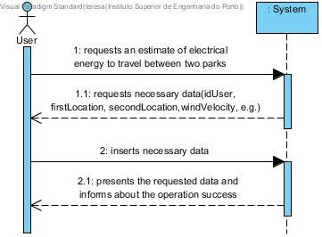
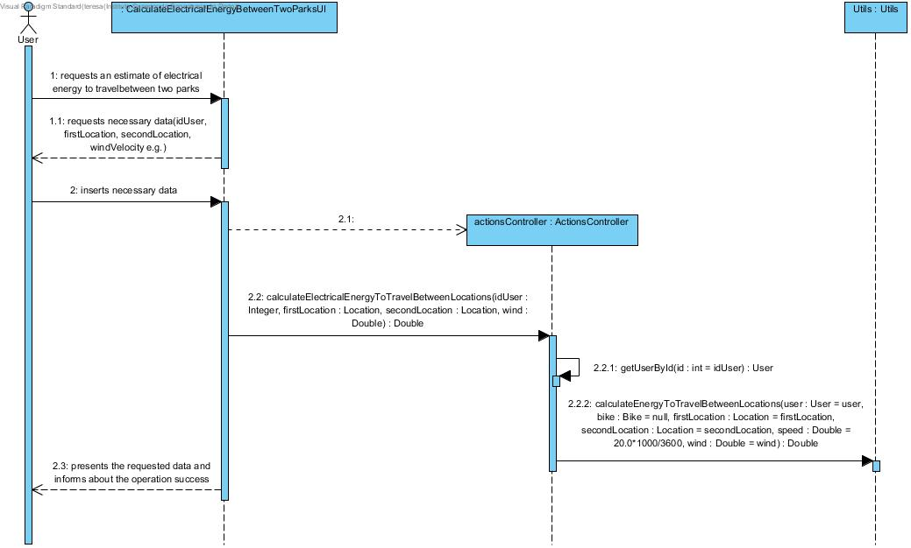
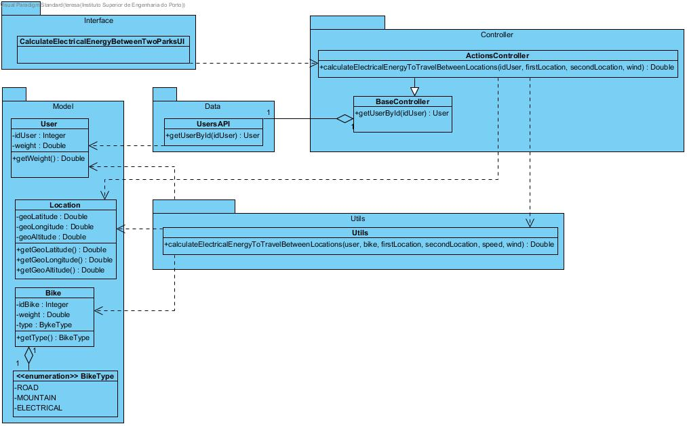

# **UC12 Calculate the Electrical Energy to Travel Between Parks**

JIRA Issue: [LAPR3G045-12](https://jira.dei.isep.ipp.pt:8443/browse/LAPR3G045-12)

## **1. Analysis**

### Brief Description

User requests for an estimate of the necessary amount of electrical energy to travel between two parks. The system requests necessary data (idUser, idBike, firstLocation, secondLocation, speed, e.g.). User inserts requested data.  The system presents inserted data and requests confirmation. After confirmation the system presents the amount of necessary energy to travel between locations and informs about the operation success. 

### Main Actor

User

### System Sequence Diagram (SSD)

## **2. Design**

### Sequence Diagram

### Class Diagram

