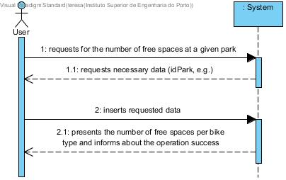
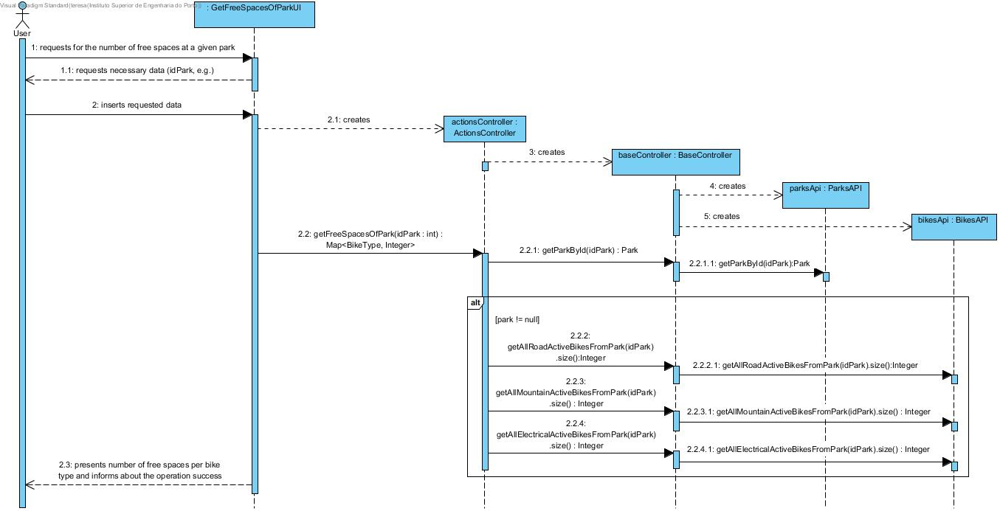
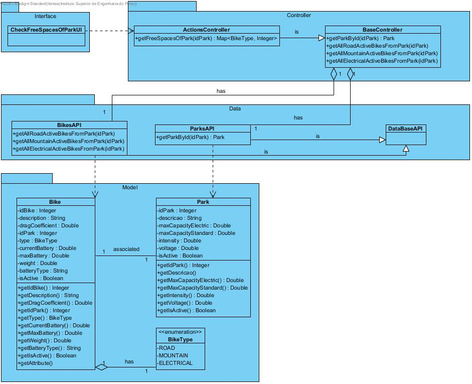

# **UC13 Check Free Spaces of Park**

JIRA Issue: [LAPR3G045-13](https://jira.dei.isep.ipp.pt:8443/browse/LAPR3G045-13)

## **1. Analysis**

### Brief Description

Users requests to check if a destination park has any free parking places for their currently loaned bicycle. System requests necessary data (idBike, idPark, e.g). User inserts requested data. System presents a true false response accordingly to the current situation and informs about the operation success.

### Main Actor

User

### System Sequence Diagram (SSD)

## **2. Design**

### Sequence Diagram

### Class Diagram

