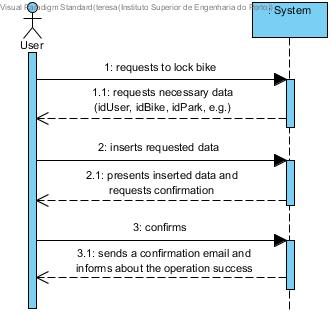
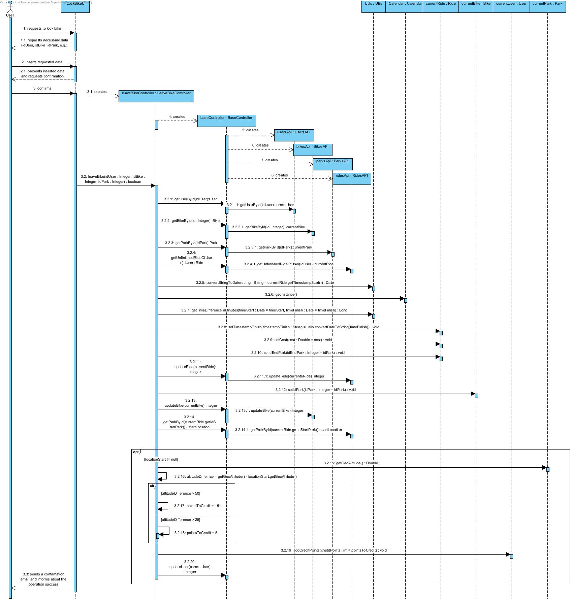
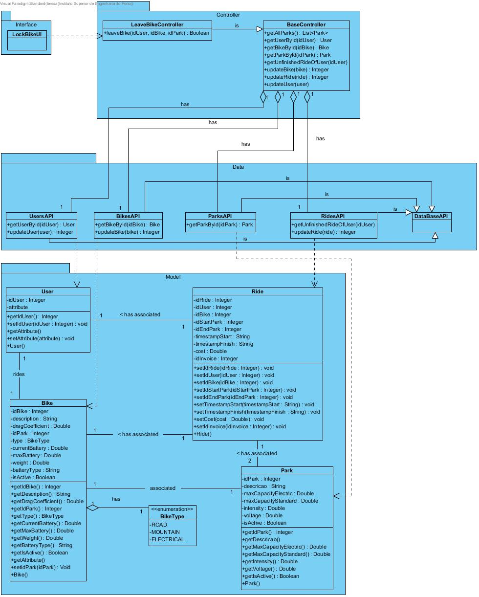

# **UC14 Lock Bicycle (Leave Bicycle)**

JIRA Issue: [LAPR3G045-14](https://jira.dei.isep.ipp.pt:8443/browse/LAPR3G045-14)

## **1. Analysis**

### Brief Description

User requests to lock a bike. System requests necessary data (idUser, idBike, idPark, e.g.). User inserts requested data. System presents inserted data and requests confirmation. User confirms and the system presents a true or false information accordingly the situation and informs about the operation success.
When users return a bicycle, the park availability should be updated.
User accounts can be charged. 
When the bicycle was used for more than 1h, accounts should be charged by the minute. 
After the gratuitous period, the following hours cost 3€ per hour. 
Users are given 5 points every time they park a bicycle on a park located 25m higher than the one they picked their bicycle, and 15 points when the park is 50m higher.
When users park a bicycle they should receive an e-mail stating that the bicycle is correctly locked and for how long it was taken. 

### Main Actor

User

### System Sequence Diagram (SSD)

## **2. Design**

### Sequence Diagram

### Class Diagram

