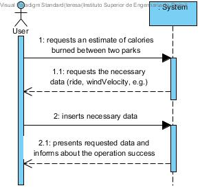
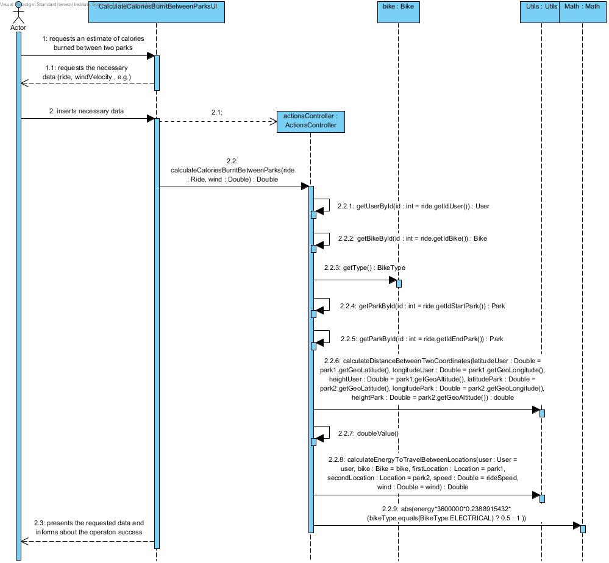
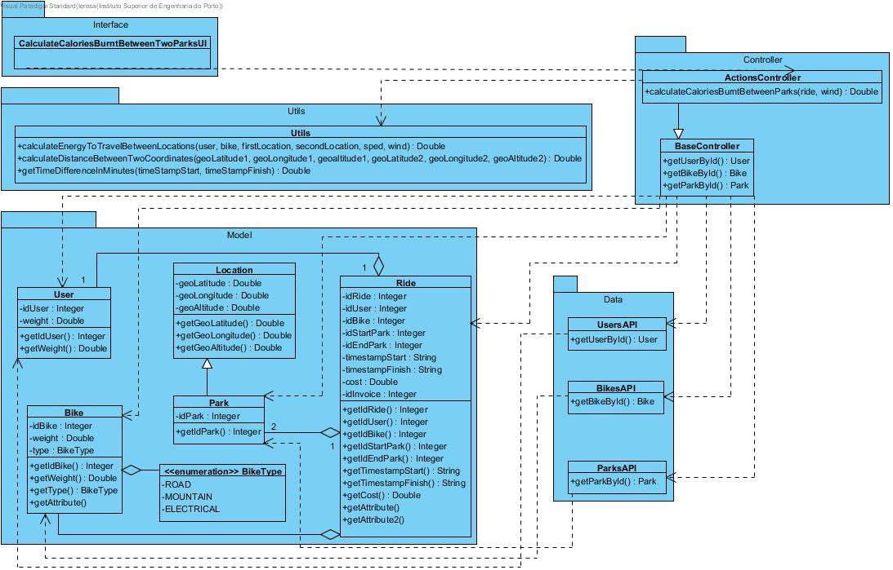

# **UC15 Calculate Calories Burnt Between Parks**

JIRA Issue: [LAPR3G045-15](https://jira.dei.isep.ipp.pt:8443/browse/LAPR3G045-15)

## **1. Analysis**

### Brief Description

User requests for an estimate of calories burned in a given ride. System requests necessary data (ride, e.g.). User inserts requested data. System presents the amount of calories burned and informs about the operation success.

### Main Actor

User

### System Sequence Diagram (SSD)

## **2. Design**

### Sequence Diagram

### Class Diagram

