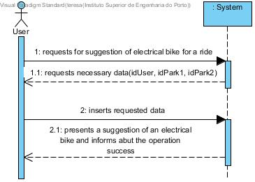
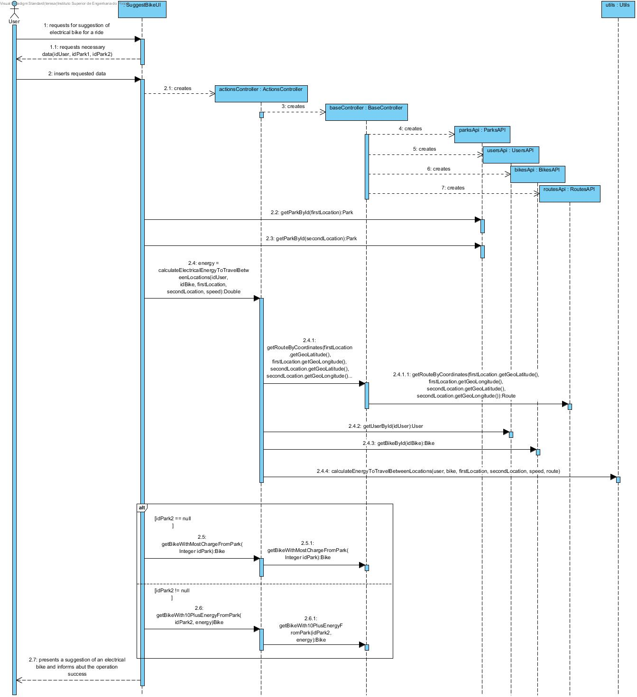
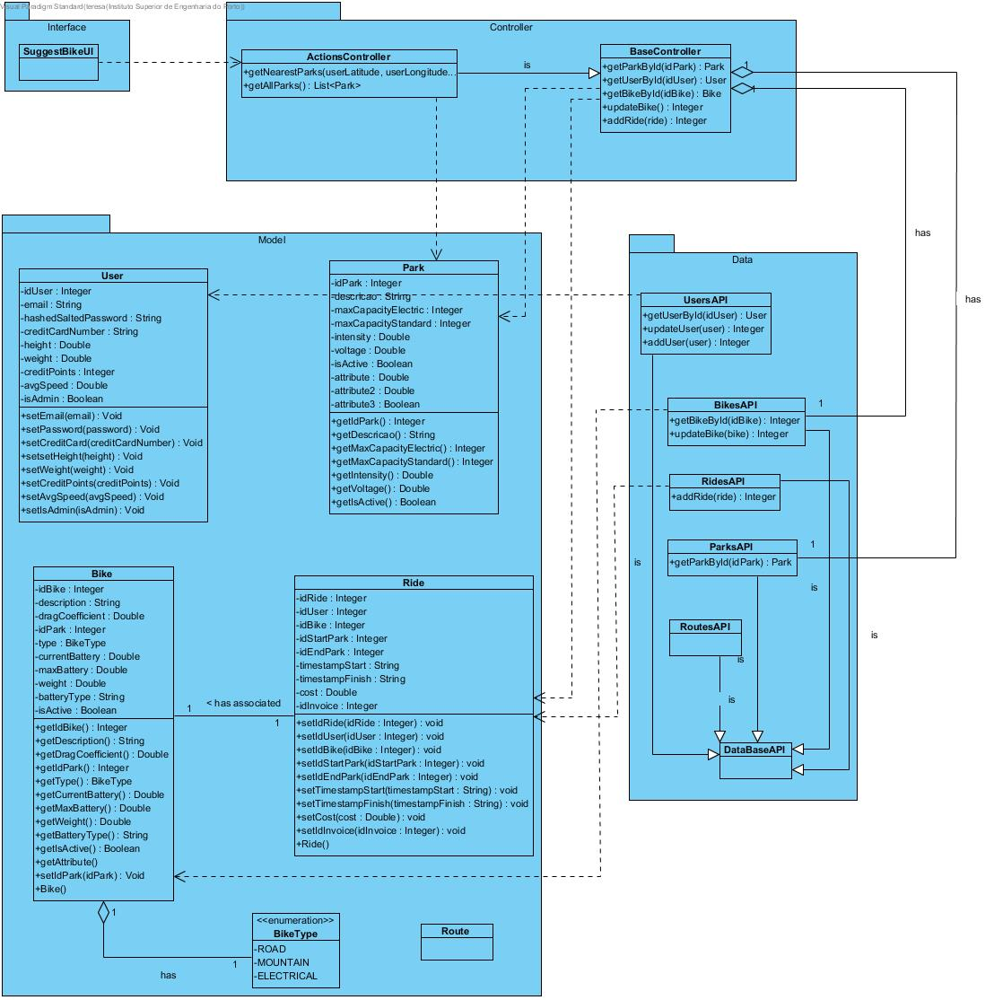

# **UC16 Suggest Bike**

JIRA Issue: [LAPR3G045-16](https://jira.dei.isep.ipp.pt:8443/browse/LAPR3G045-16)

## **1. Analysis**

### Brief Description

User requests an electrical bike suggestion. System requests necessary data (idPark1, idPark2, e.g.). User inserts requested data. System presents bike suggestion and informs about the operation success. If user gives a destination park the system suggests an electrical bike with 10% plus necessary energy for the ride or the most charged bike from the given start park.

### Main Actor

User

### System Sequence Diagram (SSD)

## **2. Design**

### Sequence Diagram

### Class Diagram

