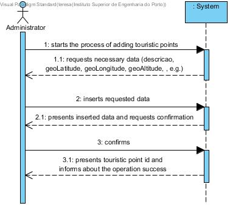
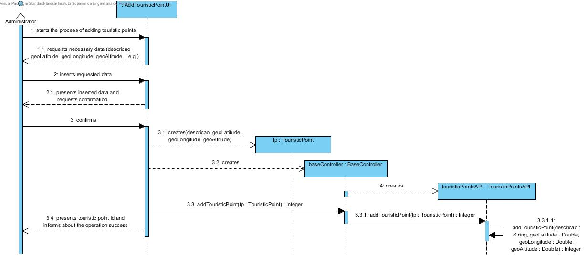
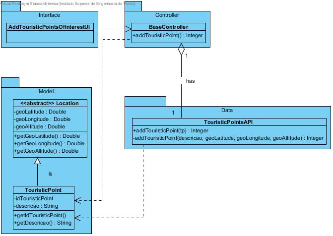

# **UC17 Add Touristic Interest Points**

JIRA Issue: [LAPR3G045-94](https://jira.dei.isep.ipp.pt:8443/browse/LAPR3G045-94)

## **1. Analysis**

### Brief Description

Admin starts the process of adding touristic points to the application. System requests necessary data (geoLatitude, geoLongitude, geoAltitude, descricao, e.g.). User inserts requested data. System presents inserted data and requests confirmation. User confirms and the system presents the new touristic point id and informs about the operation success.

### Main Actor

Administrator

### System Sequence Diagram (SSD)

## **2. Design**

### Sequence Diagram

### Class Diagram

