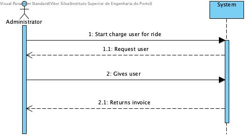
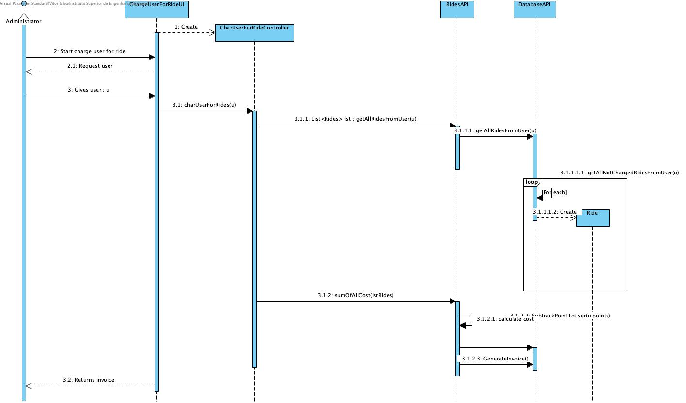
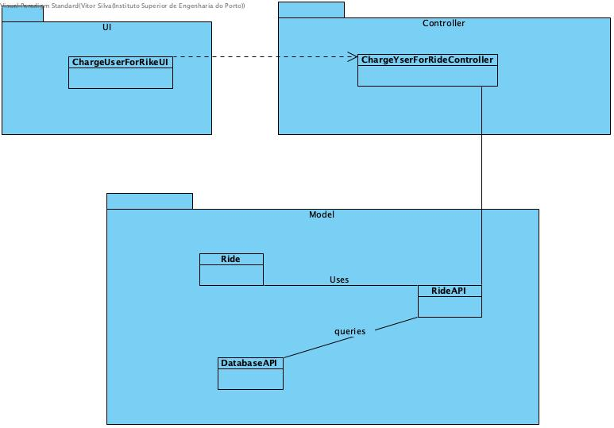

# **UC18 Charge User for Ride**

JIRA Issue: [LAPR3G045-92](https://jira.dei.isep.ipp.pt:8443/browse/LAPR3G045-92)

## **1. Analysis**

### Brief Description

System issues invoices to the users at the end of each month.    
Users’ points may be used to partially pay the invoice.
Before issuing invoices, the system should check if users have any accumulated bonus points. Every 10 points can be exchanged for one euro. For example, if a user has to pay 1,50€ but has 25 points, the invoice should be issued with 0,50€ and 10 points should be removed from the user accumulated points. No negative or fractional points are allowed.

### Main Actor

System

### System Sequence Diagram (SSD)

## **2. Design**

### Sequence Diagram

### Class Diagram

