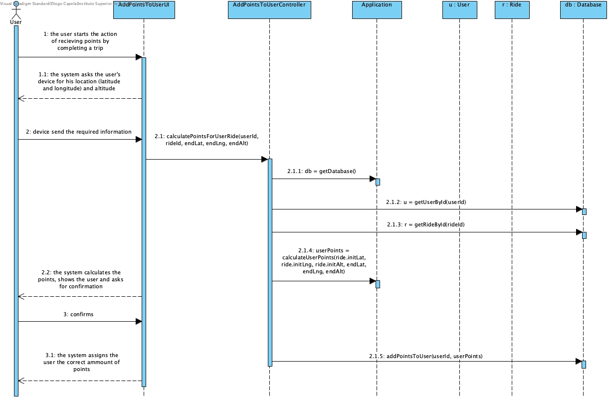

# **UC19 Assign Points to User**

JIRA Issue: [LAPR3G045-93](https://jira.dei.isep.ipp.pt:8443/browse/LAPR3G045-93)

## **1. Analysis**

### Brief Description

There is also a system for crediting points based on certain user actions. For example, at the moment, when a user picks-up a bicycle and leaves it on park situated in a place with a higher elevation/altitude points are credited to the user.

User’s monthly cost is issued to the user, by using invoices. Users’ points may be used to partially pay the invoice.

Users are given 5 points every time they park a bicycle on a park located 25m higher than the one they picked their bicycle, and 15 points when the park is 50m higher.

Before issuing invoices, the system should check if users have any accumulated bonus points. Every 10 points can be exchanged for one euro. For example, if a user has to pay 1,50€ but has 25 points, the invoice should be issued with 0,50€ and 10 points should be removed from the user accumulated points. No negative or fractional points are allowed.

### Main Actor

User Actions (End of a Ride)

### System Sequence Diagram (SSD)

## **2. Design**

### Sequence Diagram

### Class Diagram

