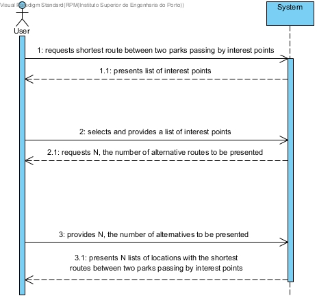
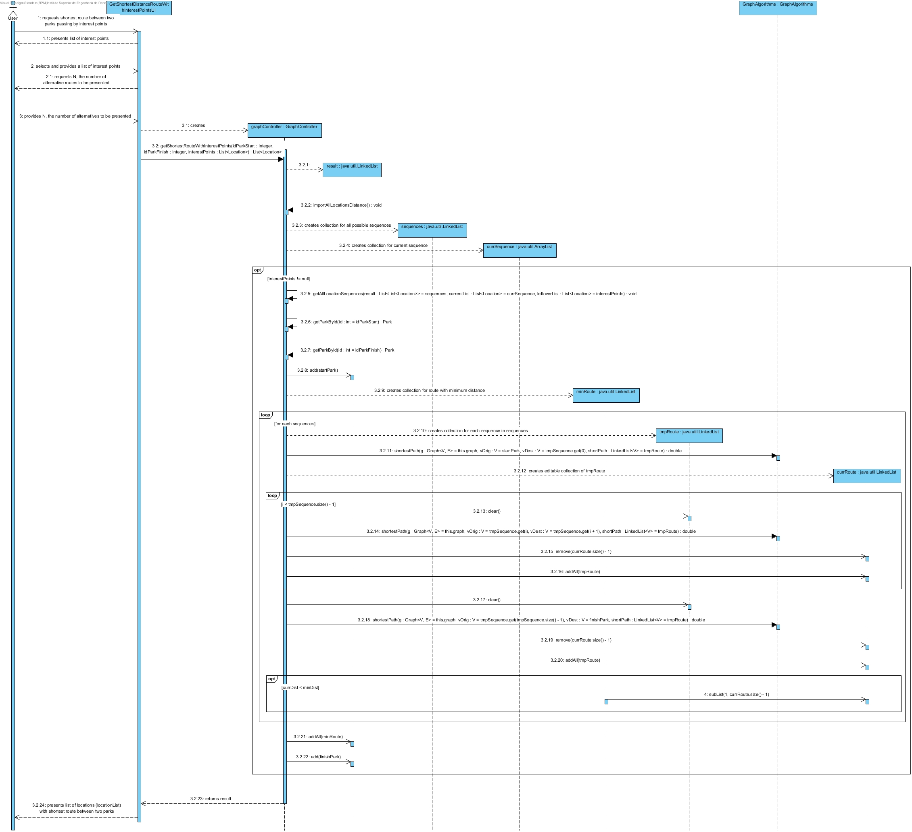
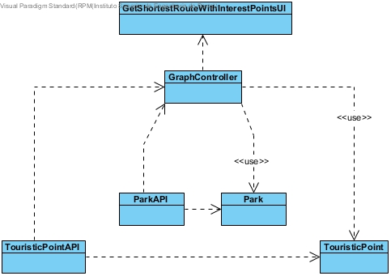

# **UC22 Calculate shortest route between two parks with interest points**

JIRA Issue: [LAPR3G045-101](https://jira.dei.isep.ipp.pt:8443/browse/LAPR3G045-101)

## **1. Analysis**

### Brief Description

When requesting a bicycle, the user should be able to request the shortest route between two parks that goes by at least a certain number of interest points, which can be specified by the user;

### Main Actor

User

### System Sequence Diagram (SSD)

## **2. Design**

### Sequence Diagram

### Class Diagram

