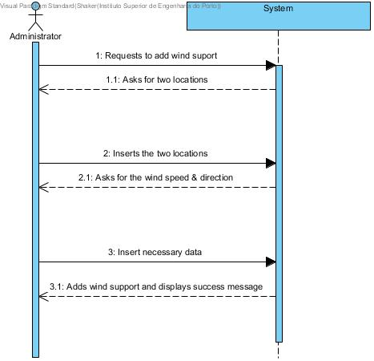
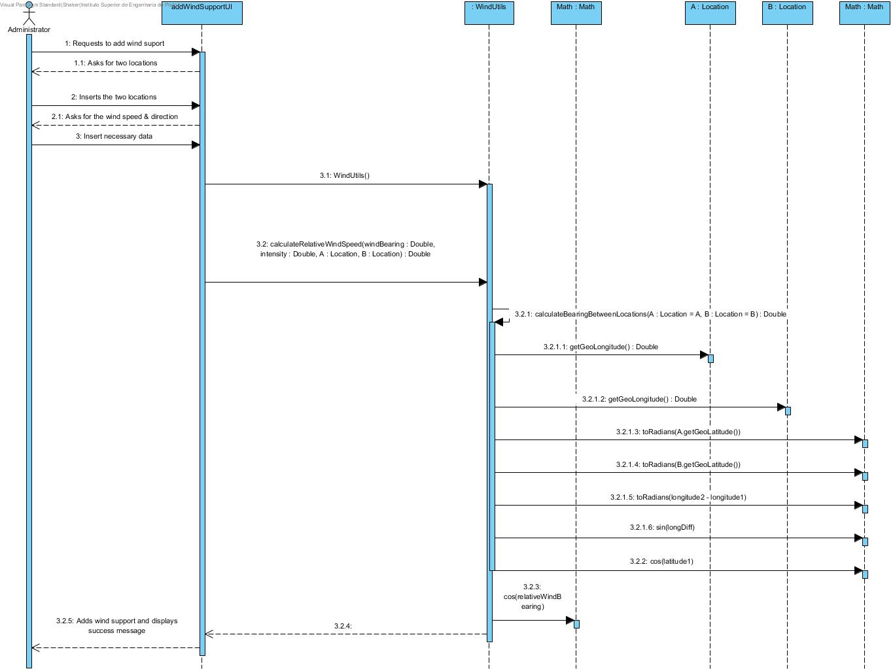
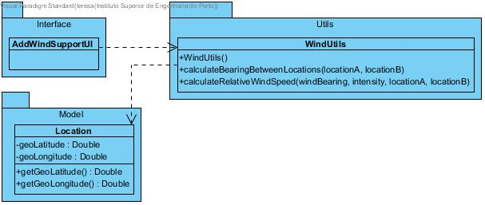

# **UC24 Add Wind Support Information **

JIRA Issue: [LAPR3G045-98](https://jira.dei.isep.ipp.pt:8443/browse/LAPR3G045-98)

## **1. Analysis**

### Brief Description

Admin starts the process of adding wind support to the application. System requests necessary data (firstLocation, secondLocation, e.g.). Admin inserts requested data. System presents inserted data and requests confirmation. Admin confirms. System requests more necessary data (windSpeed, windDirection, e.g.). Admin inserts requested data. System presents inserted data and requests confirmation. Admin confirms. System adds wind information to each existing route of the application and informs about the operation success. 
 
### Main Actor

Administrator

### System Sequence Diagram (SSD)

## **2. Design**

### Sequence Diagram

### Class Diagram

