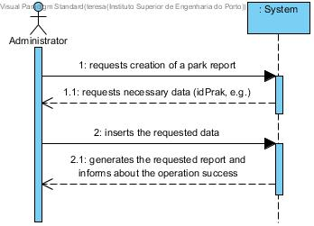
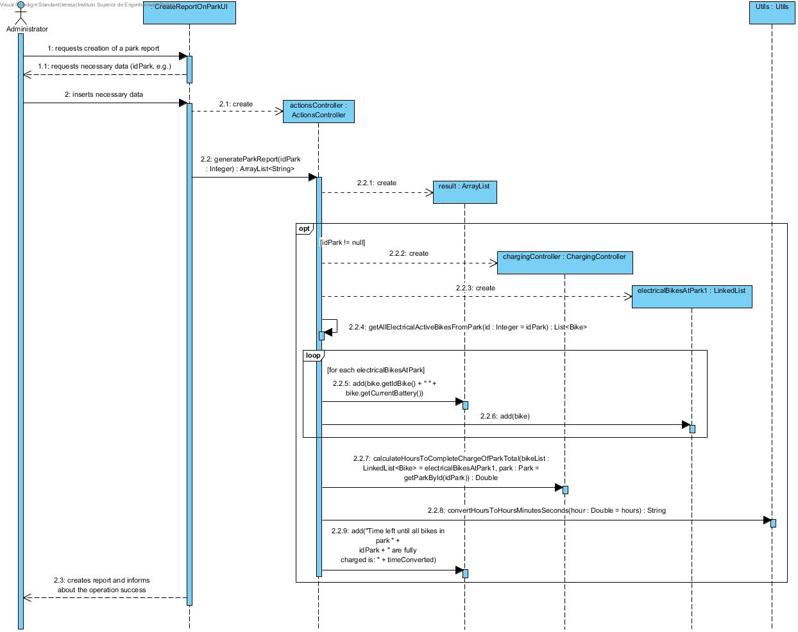
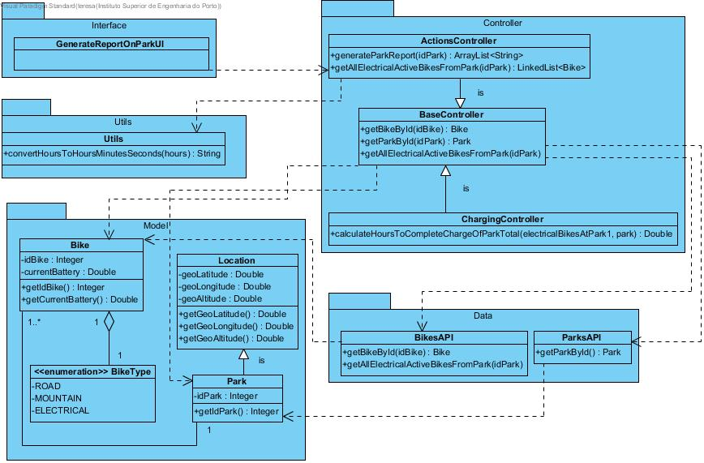

# **UC25 Create Park Report**

JIRA Issue: [LAPR3G045-97](https://jira.dei.isep.ipp.pt:8443/browse/LAPR3G045-97)

## **1. Analysis**

### Brief Description

Admin starts the process of generating a park report. System requests necessary data (idPark, e.g.). Admin inserts requested data. System presents information stating the current charging status for each bicycle and an estimate projection for how long it would take for each bicycle to reach 100% charge under the existing circumstances and informs about the operation success.

### Main Actor

ACTOR

### System Sequence Diagram (SSD)

## **2. Design**

### Sequence Diagram

### Class Diagram

